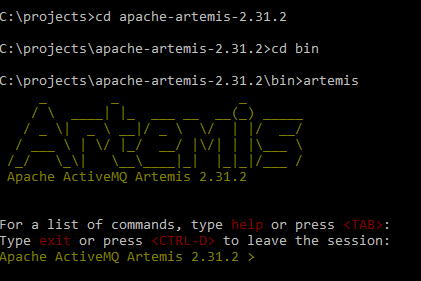

# PizzaCloud

### Инструменты:

Java(17), Maven(3.8.1), jUnit(5), Mockito, Liquibase(h2database), Tomcat, PostgreSQL(10.5), Spring Boot(3.0.5), Lombok.

### Описание локального запуска Artemis:

1) Скачать с  [официального сайта](https://activemq.apache.org/components/artemis/download/) архив в формате zip;
2) Распаковать архив;
3) Вызвать командную строку в режиме администратора (cmd);
4) Перейти в папку с распакованным архивом;
5) Перейти в папку bin;
6) Запустить artemis (в командной строке вызвать "artemis")
   
7) Для создания нового брокера необходимо выполнить команду create с указанием папки (в которую сохранится брокер) и
   логином и паролем (artemis create ***название папки*** --user=***логин*** --password=***пароль*** );
8) Согласиться с доступом;
9) Если перейти в распакованный архив, то там появится папка, название которой указано в пункте 7;
10) Перейти в созданную папку;
11) Перейти в папку bin;
12) Вызвать следующую строку - ***artemis-service.exe install***;
13) Для запуска брокера выполните следующую строку - ***artemis-service.exe start***;
14) Чтобы проверить статус брокера, введите следующую команду - ***artemis-service.exe status*** если брокер работает,
    то статус будет ***Started***;
15) Для проверки работы Artemis, перейдите по следующей [ссылке](http://localhost:8161/console/login).

### Описание сервиса:

Данный сервис позволяет заказать пиццу через интернет. Приложение позволяет собрать свою собственную пиццу из имеющихся
ингредиентов. Приложение извлекает список доступных ингредиентов из базы данных и передаёт информацию пользователю.

В данном сервисе присутствует авторизация и аутентификация. В базе данных хранятся история заказов пользователя.

Добавление и удаление ингредиентов из списка доступных ингредиентов доступно только пользователю с ролью администратор.
У приложения есть разработанное API, которое позволяет добавлять и удалять ингредиенты администратору.

После осуществления заказа, можно оплатить заказ и оформить доставку.